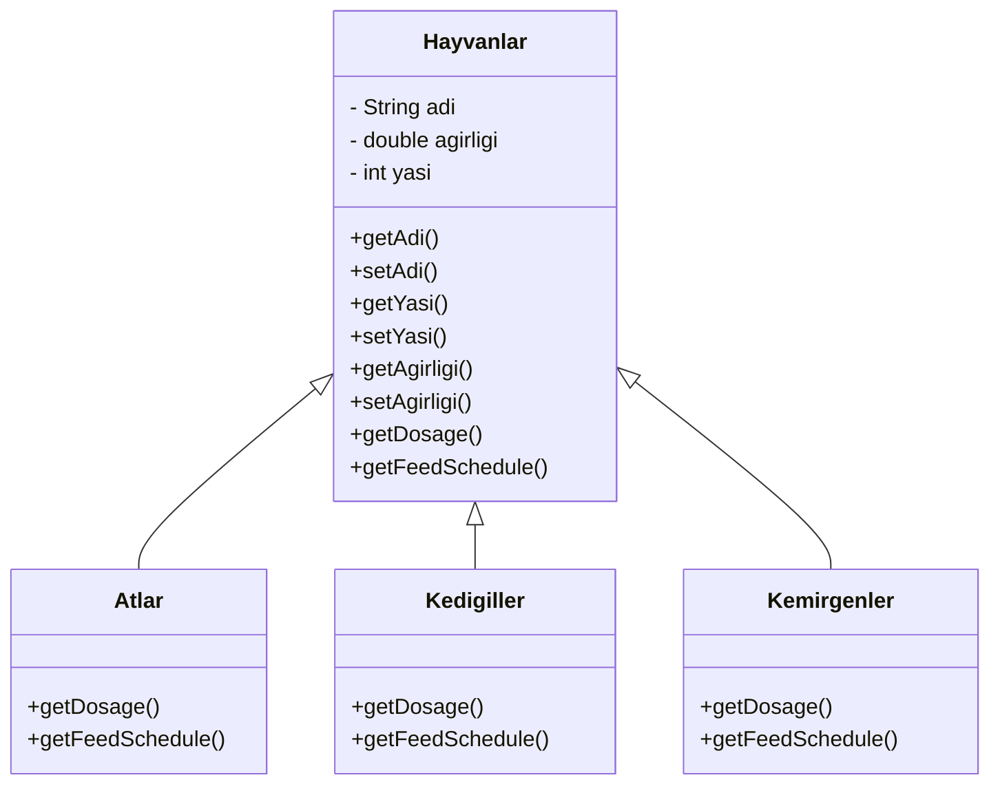

```mermaid
classDiagram
    Hayvanlar <|-- Atlar
    Hayvanlar <|-- Kedigiller
    Hayvanlar <|-- Kemirgenler
   
 
    
    class Hayvanlar{
    - String adi
    - double agirligi
    - int yasi
    
    +getAdi()
    +setAdi()
    +getYasi()
    +setYasi()
    +getAgirligi()
    +setAgirligi()
    +getDosage()
    +getFeedSchedule()
    }
    class Atlar{
       +getDosage()
    +getFeedSchedule()
    }
    class Kedigiller{
        +getDosage()
    +getFeedSchedule()
    }
    class Kemirgenler{
    +getDosage()
    +getFeedSchedule()
    }
    
```
